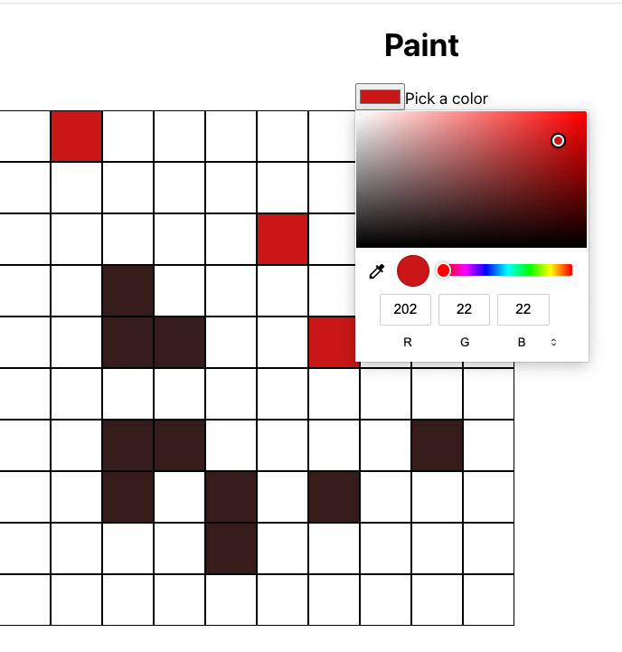

# 🎨  paint-app


A simple paint application built with **React.js** and basic state management. Users can select a color and paint individual squares on a 10x10 grid.

## ✨ Features
- 🎨 Color Picker – Users can select any color using a color input.

- 🧱 10x10 Grid – Click any square to paint it with the selected color.

- 🔄 Overwrite Colors – Re-click a square to overwrite it with a new color.


## Images



## 🛠️ Setup & Run Locally
```bash
git clone https://github.com/somramnani/paint-app.git
cd paint-app
npm install
npm run dev   # or `npm start` depending on your setup
```


## 🧩 Code Snippet
Here's a sample of how the app is structured using React and useState:

```bash
//App.jsx
import { useState } from "react";
import Square from "./components/Square";

import "./App.css";
import { useState } from "react";
import Square from "./components/Square";

function App() {
  const board = Array(10).fill(Array(10).fill(null));
  const [userInput, setUserInput] = useState("#000000");

  const handleOnChange = (e) => {
    setUserInput(e.target.value);
  };

  return (
    <div className="App">
      <h1>Paint</h1>
      <div className="color-selector">
        <input
          type="color"
          id="head"
          name="head"
          value={userInput}
          onChange={(e) => handleOnChange(e)}
        />
        <label for="head">Pick a color</label>
      </div>
      <div className="board-container">
        {board.map((pixel, colIndex) => {
          return (
            <div className="square-container">
              {pixel.map((square, index) => {
                return <Square selectedColor={userInput} />;
              })}
            </div>
          );
        })}
      </div>
    </div>
  );
}

export default App;
```
## 📂 Folder Structure

```bash
paint-app/
├── public/
├── src/
│   ├── components/
│   │   └── Square.js
│   ├── App.js
│   └── App.css
├── package.json
└── README.md


```

